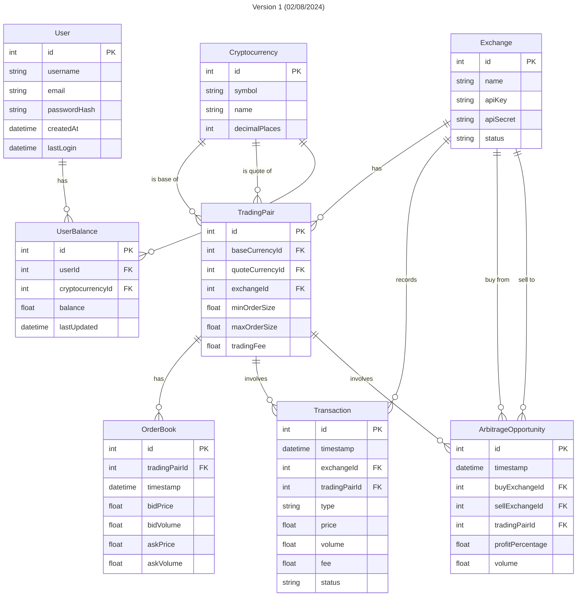

# WEB3 ARBITRATION (2024)

## Database schema

```mermaid
---
title: Version 1 (02/08/2024)
---
erDiagram
Exchange ||--o{ TradingPair : has
Exchange ||--o{ Transaction : records
Exchange ||--o{ ArbitrageOpportunity : "buy from"
Exchange ||--o{ ArbitrageOpportunity : "sell to"
Cryptocurrency ||--o{ TradingPair : "is base of"
Cryptocurrency ||--o{ TradingPair : "is quote of"
Cryptocurrency ||--o{ UserBalance : has
TradingPair ||--o{ OrderBook : has
TradingPair ||--o{ Transaction : involves
TradingPair ||--o{ ArbitrageOpportunity : involves
User ||--o{ UserBalance : has

Exchange {
    int id PK
    string name
    string apiKey
    string apiSecret
    string status
}

Cryptocurrency {
    int id PK
    string symbol
    string name
    int decimalPlaces
}

TradingPair {
    int id PK
    int baseCurrencyId FK
    int quoteCurrencyId FK
    int exchangeId FK
    float minOrderSize
    float maxOrderSize
    float tradingFee
}

OrderBook {
    int id PK
    int tradingPairId FK
    datetime timestamp
    float bidPrice
    float bidVolume
    float askPrice
    float askVolume
}

ArbitrageOpportunity {
    int id PK
    datetime timestamp
    int buyExchangeId FK
    int sellExchangeId FK
    int tradingPairId FK
    float profitPercentage
    float volume
}

Transaction {
    int id PK
    datetime timestamp
    int exchangeId FK
    int tradingPairId FK
    string type
    float price
    float volume
    float fee
    string status
}

User {
    int id PK
    string username
    string email
    string passwordHash
    datetime createdAt
    datetime lastLogin
}

UserBalance {
    int id PK
    int userId FK
    int cryptocurrencyId FK
    float balance
    datetime lastUpdated
}
```

## Backend

- TODO

## Frontend

- TODO
